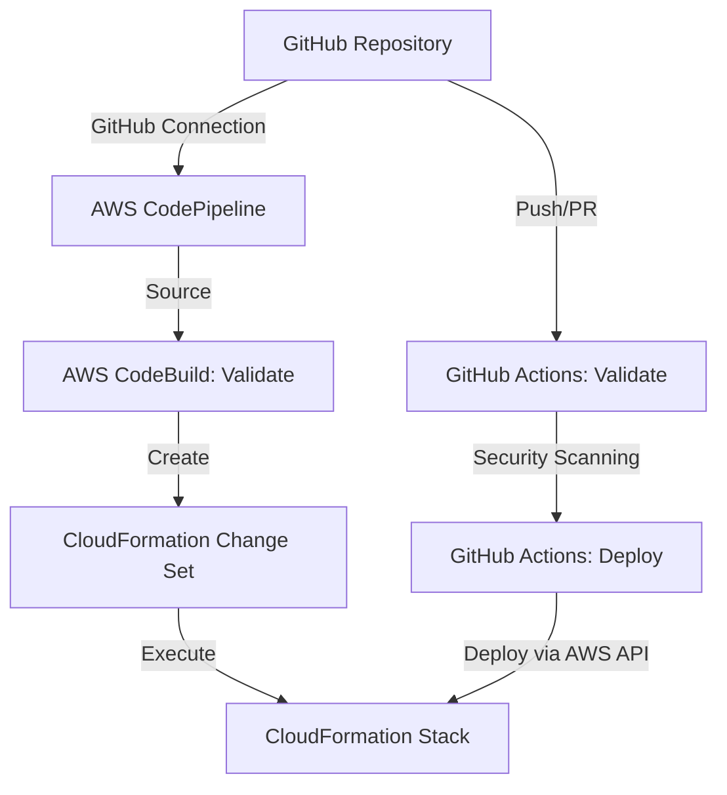

# CI/CD Pipeline for CloudFormation Templates

This document outlines the CI/CD pipeline setup for deploying CloudFormation templates.

## Architecture Overview



## CI/CD Components

### GitHub Actions Workflows

1. **Validation Workflow** (`.github/workflows/validate.yml`)
   - Runs on PR and push to main/develop branches
   - Validates CloudFormation templates with AWS CLI
   - Runs `cfn-lint` for best practice checks
   - Runs `checkov` for security scanning
   - Creates a change set for review (without execution)

2. **Deployment Workflow** (`.github/workflows/deploy.yml`)
   - Manual trigger with environment selection
   - Auto-trigger on push to main (for production)
   - Advanced security scanning with SARIF reports for GitHub Security tab
   - Packages and deploys the CloudFormation templates

### AWS-Based Pipeline

1. **AWS CodePipeline** (`templates/aws-pipeline.yaml`)
   - Source stage connects to GitHub repository
   - Build stage performs template validation
   - CreateChangeSet stage generates changes for review
   - Deploy stage applies changes to AWS environment

## Setup Instructions

### 1. Setting up GitHub Actions OIDC Role

The GitHub Actions workflows use OIDC authentication to securely assume an AWS IAM role:

```bash
# Edit the variables in setup-github-actions-role.bat
# Then run:
setup-github-actions-role.bat
```

After running the script:
1. Copy the Role ARN from the generated file
2. Add the ARN as a GitHub secret named `AWS_ROLE_TO_ASSUME`

### 2. Setting up AWS CodePipeline (Optional)

This provides a second deployment method using AWS services:

```bash
# Edit the variables in setup-aws-pipeline.bat
# Then run:
setup-aws-pipeline.bat
```

You'll need to complete the GitHub connection by following the instructions provided during setup.

## Deployment Strategy

The pipeline supports multiple environments:

1. **Development Environment**
   - Deployed from the `develop` branch
   - Uses `dev-parameters.json` for configuration
   - Automatic change set generation
   - Manual review and deployment

2. **Production Environment**
   - Deployed from the `main` branch
   - Uses `prod-parameters.json` for configuration
   - Requires manual confirmation for deployment

## Security Features

The CI/CD pipeline includes several security measures:

- **Template Validation**: Checks for syntactical correctness
- **CFN-Lint**: Checks for CloudFormation best practices
- **Checkov**: Scans for security issues in infrastructure code
- **SARIF Reports**: Integrated with GitHub Security tab for visualization
- **Manual Approvals**: Required for production deployments
- **OIDC Authentication**: Secure authentication without long-term credentials

## Pipeline Customization

To customize the pipeline for your needs:

1. Edit the parameter files (`dev-parameters.json`, `prod-parameters.json`)
2. Modify the GitHub Actions workflows in `.github/workflows/`
3. Update the AWS CodePipeline template in `templates/aws-pipeline.yaml`

## Disaster Recovery

In case of failed deployments:

1. Use CloudFormation to roll back to the previous stable state
2. Review CloudFormation stack events to diagnose issues
3. Fix templates and redeploy

## Additional Resources

- [AWS CloudFormation Documentation](https://docs.aws.amazon.com/cloudformation/)
- [GitHub Actions Documentation](https://docs.github.com/en/actions)
- [AWS CodePipeline Documentation](https://docs.aws.amazon.com/codepipeline/)